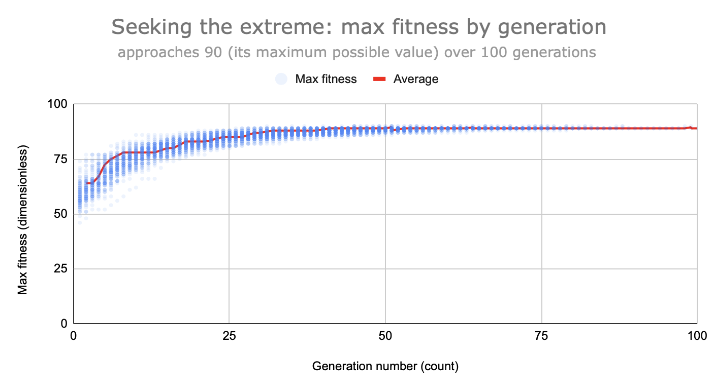
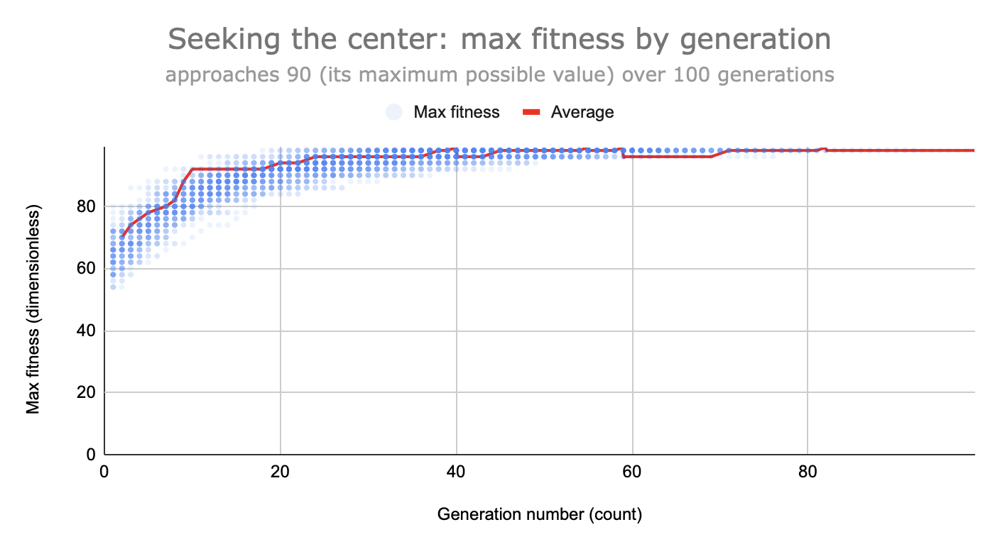
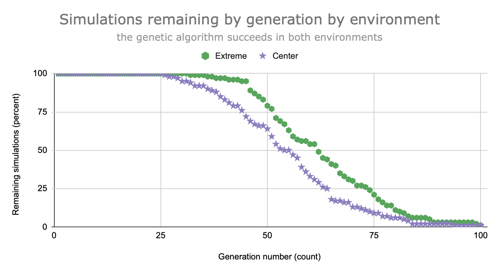

<!-- You are reading the markdown source version of this report. You can get a typeset PDF version by using a conversion tool like [pandoc](https://pandoc.org): run the command `pandoc README.md -o report.pdf` to produce a PDF report. -->

# What landscapes are genetic algorithms good at?

A genetic algorithm is a state space search strategy. It recombines a population of states to produce more optimal states, much like how evolution by natural selection recombines a population of individuals to produce more optimal populations of individuals.

With a well-chosen fitness function, computer scientists hope to use genetic algorithms to efficiently find optimal states. I perform a case study on what environments genetic algorithms are well-suited to, with a focus on reaching the extrema of state spaces.

## Setup

[This repository](https://github.com/Tridwoxi/Genetic) contains the following non-hidden files:

- `README.md`: This file.
- `pyproject.toml`: Project configuration.
- `src/genetic.py`: Genetic algorithm implementation and driver (main file).
- `src/_analysis.py`: Ad-hoc analysis.
- `assets/*`: Supporting visualizations.

You need python>=3.12 for typing. No third-party dependencies.

## Model

A state is an element from a set. I will model a state as a tuple of integers to represent a point in a high-dimensional space.

The genetic algorithm is modeled as follows:

```txt
subroutine "genetic search" accepts (
    "recombinator", a subroutine that merges two states;
    "mutator", a subroutine that changes a state;
    "goal test", a subroutine that determines when a state is
        sufficiently optimal;
    "fitness", a subroutine that evaluates how optimal a state is;
    "selector", a subroutine that drops states from the population
        pool;
    "max generations", a strictly positive integer specifying how
        long the algorithm runs until it gives up;
    "reproductions", a strictly positive integer specifying number
        of children and carrying capacity;
) returns (
    "result" if the search succeeds or nothing if the search fails;
) has side effects (
    nothing;
) {
    let "population" be a list of random states;
    do "max generations" times {
        let "fitnesses" be the fitnesses of "population" according
            to "fitness";
        for each "member" of "population" {
            if "member" means the "goal test" {
                return "member" as result;
            }
        }
        let "mating pairs" be pairs of parents, with probability
            proportional to their fitness;
        let "children" be the offspring of "mating pairs"
            according to "recombinator";
        let "children" be a mutated version of "children"
            according to "mutator";
        let "population" be a subset of "parents" and "children"
            according to "selector";
    }
    return nothing as failure;
}
```

I will call each set of parameters an "environment" analogously to how evolution will run its course differently across environments.

Contrary to the model, a real-world implementation of a genetic algorithm may hardcode most aspects to solve a particular task. I supply them as parameters because I want to see what happens when I change them.

My python implementation also differs slightly. Being designed for analysis, it has printing side effects, an unconventional parameter passing pattern, and returns more than it should. Motivation and details can be found in the source file.

## Experiment

I used this configuration on a MacBook Pro (2024, Apple M4 Pro chip, 24 GB memory) with python==3.14.0 and without seeding:

```sh
$ python3 src/genetic.py \
    --dimensions 10 \
    --granularity 10 \
    --initial-pop-size 10 \
    --max-generations 100 \
    --reproductions 10 \
    --trials 1000 \
    --verbose
```







Brief results for all environments:

| Environment                | Mean time (ns) | Median time (ns) | Solve rate (%) |
| -------------------------- | -------------: | ---------------: | -------------: |
| Default                    |      3,462,364 |        3,410,312 |           97.7 |
| Get to center of landscape |      3,798,360 |        3,707,792 |           99.2 |
| Only consider children     |      5,221,258 |        5,206,041 |            0.0 |
| Slow non-wrapping mutator  |      2,785,192 |        2,765,188 |          100.0 |
| Rebuild from scratch       |      6,712,719 |        6,720,000 |            0.0 |
| Multiply fitnesses         |      3,959,258 |        3,867,291 |           97.4 |
| Get prime numbered values  |        826,764 |          794,333 |          100.0 |
| Get sharp peaks            |      8,648,448 |        8,547,041 |           98.0 |
| Get origin                 |      5,345,438 |        5,414,854 |           85.3 |
| Draw child from one parent |      3,071,833 |        3,102,792 |           87.3 |

<!-- Uncomment for a Pandoc-recognized table caption: -->
<!-- : Brief results for all environments -->

## Seeking extrema

In the default environment and the command line arguments I used, the algorithm maximizes the sum of the values of states, and considers itself successful when it finds the maximum value possible, which is the state `(9, 9, 9, 9, 9, 9, 9, 9, 9, 9)`. Hence, it seeks extrema. It does so by selecting half of each parent's genes during each reproduction, regenerating a value, and keeping the most fit individuals.

All other environments are variations on the default environment. The "get to center of landscape" environment differs from the default environment in that it seeks to minimize the distance to the center of the landscape, and so has the optimal state `(4, 4, 4, 4, 4, 4, 4, 4, 4, 4)`. It uses a similar strategy as the default environment.

You may think a genetic algorithm struggles to reach extrema because when combining parents, it produces a child that is the average of both parents, and more moderate than each. Producing a midpoint would occur if the recombinator averaged all of a parent's states, like `C1` in figure 4. But genetic algorithms usually combine states by sampling a portion from each parent. By directly copying these features, the algorithm preserves extreme states, like `C2` in figure 4.


Hence, the genetic algorithm succeeds in finding both the maximum value and center of the state space when given a good heuristic. Figures 1 to 3 show that max fitness approaches its maximum value (which means the states are very similar to the target according to the fitness function) and in both environments, the algorithm succeeds half the time in around 60 generations. Seeking the center succeeds slightly faster, but I think this difference is not significant.

Similar features scoring similarly is irrelevant: to the algorithm, the value the feature takes is a meaningless dictionary key. This treatment is a good fit for the general case, where the feature "2" could be very fit, but the nearby "1" does not need to be; the "get prime numbered values" environment exploits this difference. A feature's meaning is only of interest to the programmer, who can use it to write better heuristics.

## Seeking everything else

The algorithm fails in the "only consider children" environment because it allows fitness to decrease. The algorithm struggles to optimize good states in the default environment: for example, once it reaches `(9, 9, 9, 9, 9, 9, 9, 9, 9, 8)` and mutates a value, it has a 1 in 100 chance of mutating the 8 to a 9. But in "only consider children", throwing out parents means a good state can no longer be used as a stepping stone.

The "slow non-wrapping mutator" is more efficient than the default environment. Although it takes longer to replace a bad state into a good one, it is better at optimizing good states. In the example in "only consider children", it has a 1 in 20 chance of succeeding.

"Rebuild from scratch" is essentially hopeless. Since it ignores the parent generation and creates new states at random, it is no better than random search (worse, actually, since the genetic algorithm has a lot of overhead). The chance of guessing the maximal state randomly is 1 in 10000000000.

The "multiply fitnesses" environment may have a small effect by increasing selection pressure for good states by weighing them more against sub-optimal ones, but it fails to score state like `(9, 9, 9, 9, 9, 9, 9, 9, 9, 0)` highly despite being 1 generation away from the goal. A better fitness function would be to count the number of maximal values in the state, but if we had a function like that, there wouldn't be a need for the genetic algorithm.

Since the genetic algorithm cares only about states and not the interpretation of values or the relations between them, it is unsurprising that the "get prime numbered values" environment finishes four times faster than the default. There are multiple prime numbers, but only one maximal value, so it is easier to reach the best state.

The "get sharp peaks" environment was more difficult for the algorithm. Speculatively, this is because combining two fit parents does not always produce a fit child. The child may lie in a valley between peaks, unlike the default environment where the fitness landscape is smooth.

The "get origin" environment uses a fitness function where the origin is rewarded and no information is given otherwise. It should be just as hopeless as the "rebuild from scratch" environment in guessing the origin, but succeeds most of the time because of an implementation detail: the selector uses state values as a tiebreaker, and gradually increases states that look like 0.0.

The "draw child from one parent" environment should hurt a genetic algorithm because schemas contain fragments of useful information that can be combined instead of evolving each section separately, and in my experiment it failed to solve more cases than the default. However, it was faster. Speculatively, this is because it saves compute by not recombining, and both fragments of a state usually contribute similar fitnesses.
